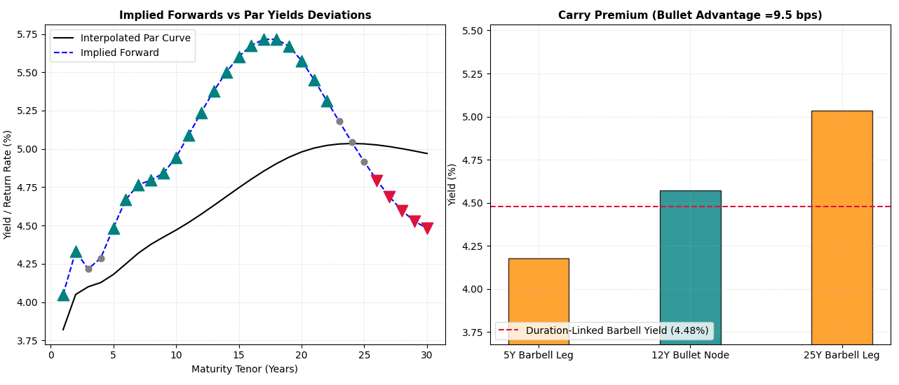

# Implied Rates Model: Forward Rate & Carry Analysis



A quantitative finance framework designed to identify structural mispricing across maturity sectors and evaluate duration-neutral investment strategies (Barbell vs. Bullet). This engine implements forward rate analysis to calculate yield cushions and breakeven hurdles, assisting in tactical allocation decisions.

## 📂 Repository Structure

```text
├── data/
│   └── treasury_curve_cache.csv # Local FRED API data snapshot (git-ignored)
├── exhibits/
│   └── model_exhibit.png       # Dashboard visualization output
├── src/
│   ├── curve_engine.py         # Ilmanen forward rate framework & strategy math
│   ├── dashboard.py            # Matplotlib visual generation component
│   └── data_loader.py          # FRED API data ingestion & cubic spline fitting
├── .gitignore                  # Prevents committing local data caches & venv
├── main.py                     # Primary execution script
└── requirements.txt            # Project library dependencies
```

📊 Overview
This project ingests live U.S. Treasury Constant Maturity data from the FRED API to construct a continuous yield curve via cubic spline interpolation. It then decomposes the curve into forward rates, highlighting sectors that are structurally "cheap" (teal markers) or "rich" (crimson markers).

🛠 Features
Spline Interpolation: Transforms discrete, unevenly spaced maturity data into a smooth 1Y-30Y continuous curve.

Forward Rate Analysis: Identifies maturity sectors where implied forward rates deviate significantly from par yields to expose structural roll-down and carry opportunities.

Strategy Optimizer: Calculates risk-neutral weights for Barbell/Bullet structures to ensure immunity against parallel yield curve shifts.

Automated Caching: Local data persistence via CSV to optimize bandwidth and minimize API rate-limiting issues.

## 🚀 Getting Started

### Prerequisites
* Python 3.x
*Core libraries: 'numpy', 'pandas, 'scipy', 'matplotlib', 'requests'


Clone the repository:
```bash
git clone https://github.com/GodsonIrabor/Implied-Rates-Model.git
cd Implied-Rates-Model
```
Install dependencies:
```bash
    pip install -r requirements.txt
```
Set your FRED API Key:
```bash
export FRED_API_KEY='your_api_key_here'
```
### Running the Engine
Execute the main runtime file to fetch live data, process the term structure, and spin up the visual analytics workspace:
```bash
python main.py
```
🧠 Methodology
This engine is built upon the forward rate framework for identifying structural mispricing within maturity sectors. By calculating directional yield cushions, the model isolates opportunities where the implied forward curve provides an attractive risk-adjusted "carry" relative to the par yield, helping separate structural market anomalies from transient rate shifts.

🖼 Visualizing the Curve
The dashboard generates two primary views to analyze fixed-income positioning:

Implied Forwards vs Par Yields: Visualizing deviations and structural anomalies across the 30-year spectrum.

Carry Premium Analysis: A direct comparison of bullet node yield vs. the duration-linked barbell leg yields to evaluate the net carry profile.


